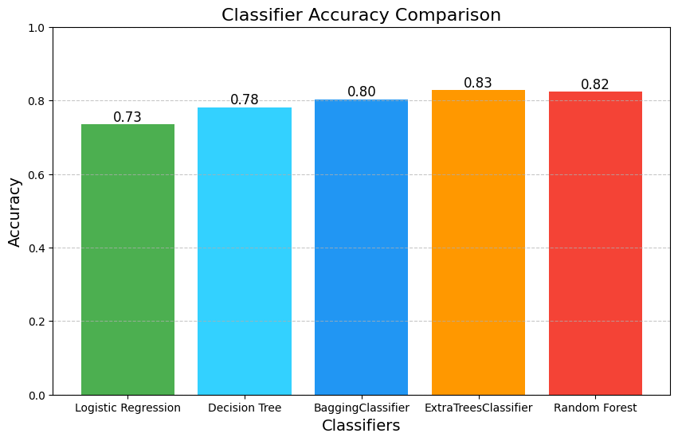

# Intelligent Smoking Classification System

## Project Overview

The **Intelligent Smoking Classification System** aims to leverage the extensive health data collected by the company to develop an intelligent system capable of determining an individual's smoking status through bio-signals. Over the years, the organization has gathered valuable information about various individuals, and now seeks to utilize this data to build a machine learning model that can classify whether a person is a smoker or non-smoker based on their health-related bio-signals.

## Problem Statement

With the increasing prevalence of smoking-related health issues, it has become essential to accurately identify individuals who smoke. The objective of this project is to create a machine learning model that can classify the presence or absence of smoking in a person using their biological signals and personal health information. Given a person's details, our system will determine whether they are likely to smoke, thereby assisting in health assessments and interventions.

## Installation

To run this project, you will need clone this repository and install the necessary dependencies. You can do so by using the following command:

```bash
git clone https://github.com/AnishMathewOommen/Intelligent_smoking_behavior_analyzer.git

pip install -r requirements.txt
```

## Dataset Information

The dataset used in this project comprises a collection of basic health biological signal data, containing approximately 55,000 records with 27 attributes. The attributes are as follows:

| Attribute                      | Description                                                         |
|-------------------------------|---------------------------------------------------------------------|
| ID                            | Unique identifier for each record                                   |
| gender                        | Gender of the person (M or F)                                     |
| age                           | Age of the person (5-year increments)                              |
| height (cm)                  | Height of the person                                               |
| weight (kg)                  | Weight of the person                                               |
| waist (cm)                   | Waist circumference length                                         |
| eyesight (left)              | Left eyesight                                                      |
| eyesight (right)             | Right eyesight                                                     |
| hearing (left)               | Hearing pulse in the left ear                                     |
| hearing (right)              | Hearing pulse in the right ear                                    |
| systolic blood pressure       | Systolic blood pressure measurement                                |
| relaxation blood pressure     | Relaxation blood pressure measurement                              |
| fasting blood sugar           | Fasting blood sugar measurement                                    |
| cholesterol total             | Total cholesterol level                                            |
| triglyceride                  | Lipid found in the blood                                          |
| HDL cholesterol               | High-density lipoprotein cholesterol type                          |
| LDL cholesterol               | Low-density lipoprotein cholesterol type                           |
| hemoglobin                    | Oxygen-carrying protein in blood                                   |
| urine protein                 | Presence of bloodborne proteins in urine                           |
| serum creatinine              | Amount of creatinine in the blood                                  |
| AST                           | Aspartate aminotransferase level                                   |
| ALT                           | Alanine aminotransferase level                                     |
| GTP                           | Gamma-glutamyl transferase level                                   |
| oral                          | Oral examination status                                            |
| dental caries                 | Tooth decay                                                       |
| tartar                        | Tartar status                                                     |
| smoking                       | Smoking status (presence or absence)                               |


## Data Analysis and Preprocessing

In the code, extensive analyses have been performed on the dataset, including various visualizations to better understand the data distribution and relationships among attributes. Key preprocessing steps include:

- Outlier detection to identify and handle anomalies in the dataset.
- Standard scaling to normalize feature values for better model performance.
- Encoding categorical features to convert them into a suitable format for machine learning algorithms.
- Feature extraction to select the most relevant attributes for classification.

## Classification Algorithms

Multiple classification algorithms have been implemented in this project to evaluate their performance in predicting smoking status:

1. **Logistic Regression**
2. **Decision Tree Classifier**
3. **Bagging Classifier**
4. **Extra Trees Classifier**
5. **Random Forest Classifier**

## Results

The accuracy of each classification algorithm is as follows:

- **Logistic Regression Accuracy:** 73.49%
- **Decision Tree Accuracy:** 78.10%
- **Bagging Accuracy:** 80.31%
- **Extra Trees Accuracy:** 82.80%
- **Random Forest Accuracy:** 82.40%



### Among the classifiers tested, the **Extra Trees Classifier** provided the best accuracy, making it the most effective model for this smoking classification task.


## Conclusion
The Intelligent Smoking Classification System demonstrates how machine learning can effectively identify smoking habits using biological signals. This system can help healthcare professionals assess individual smoking status and design appropriate interventions.